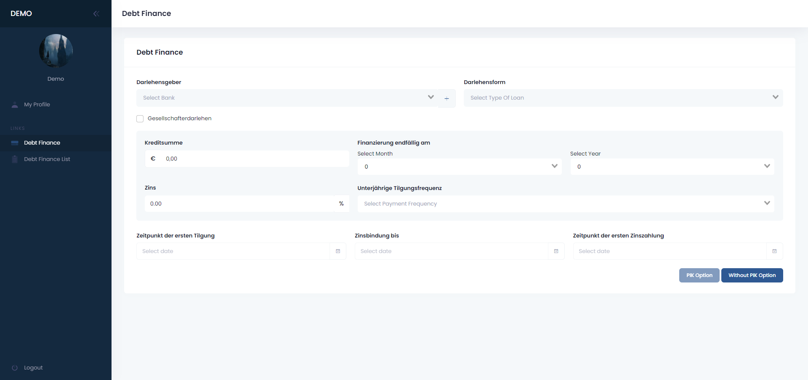
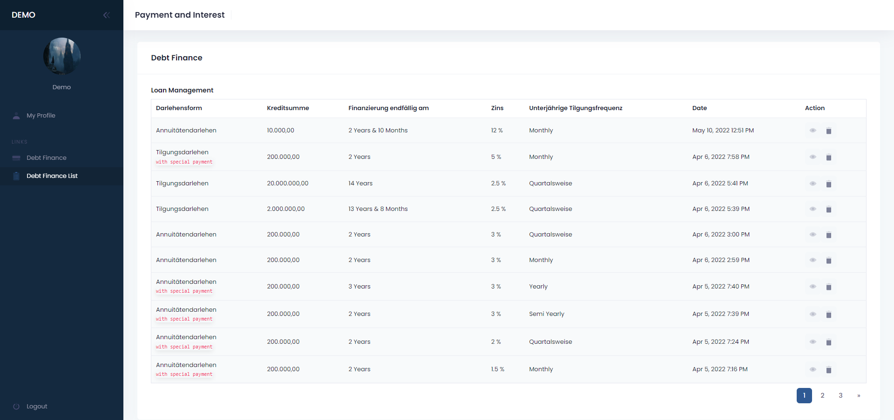
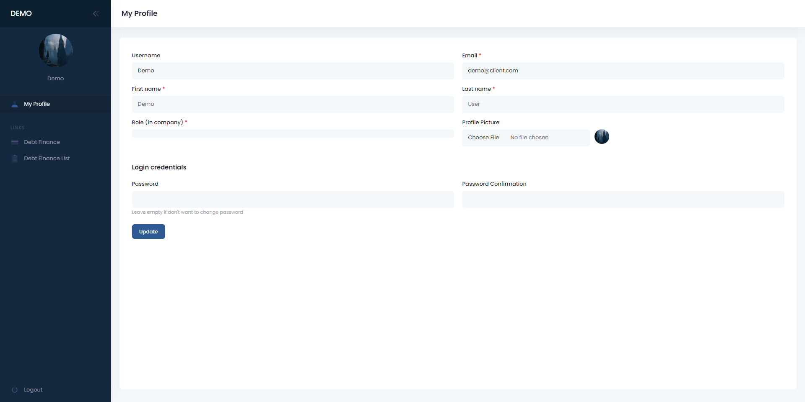
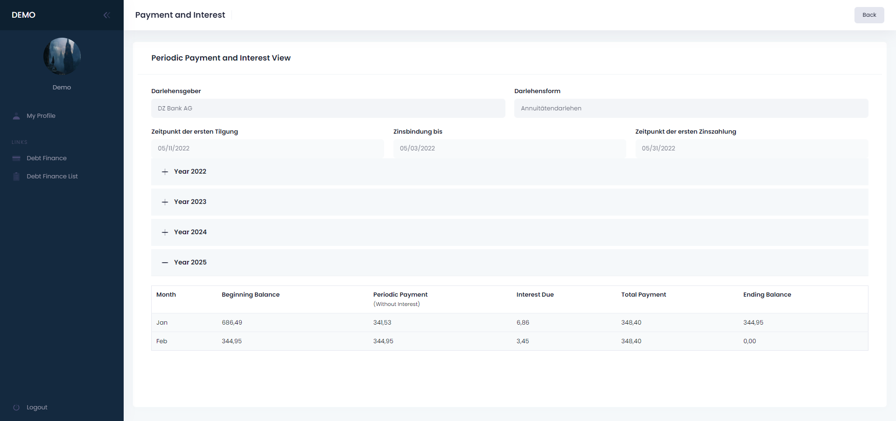

### About The Project
This is a multilingual laravel project integeration with vuejs.
This is a kind of finanance calculator for different type of loans with responsive design 
& easy to understand & manage.

### Built With

* [Laravel](https://laravel.com/)
* [VueJs](https://vuejs.org/)
* [PhP](https://www.php.net/)
* [JQuery](https://jquery.com)

### Usage
  1. User can create a emi table with different type of loans.
     
  2. User can check created emi's in responsive table.
     
  3. User can check/update his/her profile.
     
  4. User can check his emi report.
     

## Contact

ExpertCoder - codeiexper82@gmail.com

Project Link: [https://github.com/codeiexpert/Finance-Calculator]

